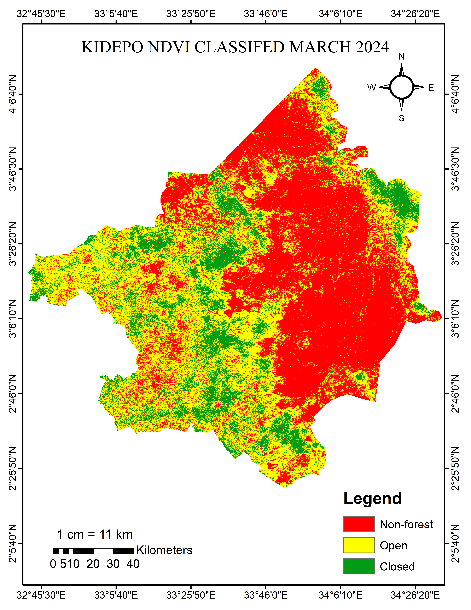
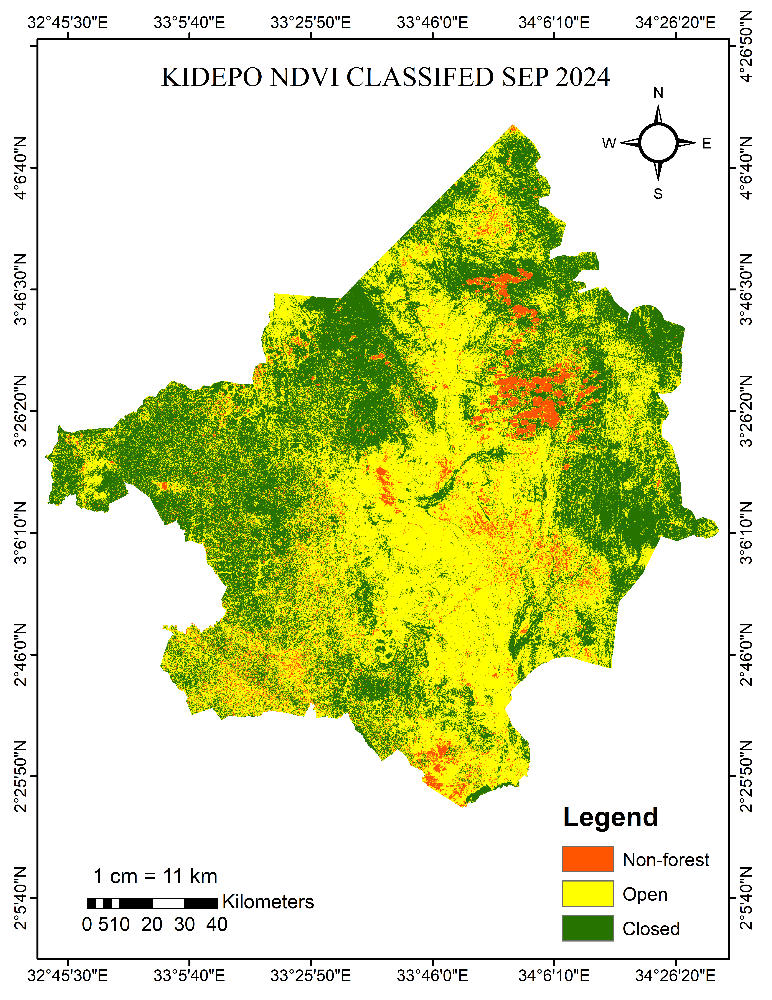
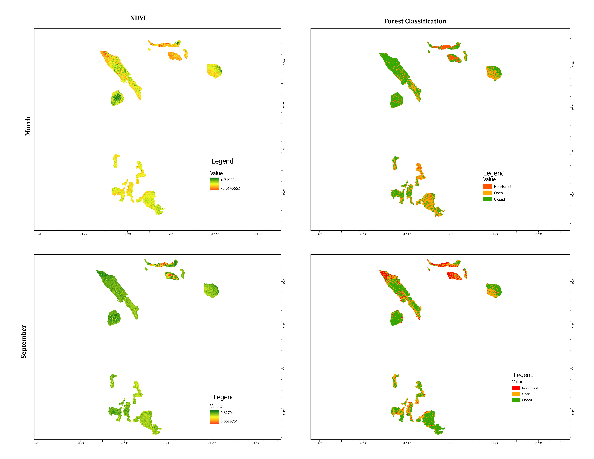
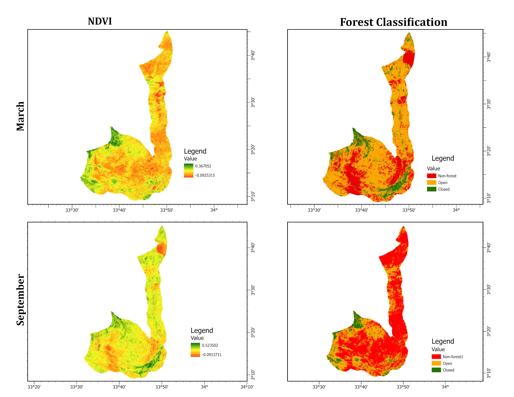

# 🌿 Seasonal NDVI Analysis of Kidepo Valley, Karamoja and Karenga Sub-regions, Uganda (2024)

> **Remote sensing project analysing seasonal vegetation health and cover across Kidepo Valley, Karamoja, and Karenga using Landsat 8 NDVI — comparing dry season (March) and wet season (September) conditions.**

---

## 📌 Project Overview

This remote sensing analysis applies the Normalized Difference Vegetation Index (NDVI) to assess vegetation health, cover, and seasonal dynamics across three ecologically significant areas in northeastern Uganda — Kidepo Valley National Park, Karamoja sub-region, and Karenga sub-region. Using Level-2 Landsat 8 (OLI) imagery from March and September 2024, the study captures the contrast between dry season stress and wet season recovery, and classifies vegetation into three cover types to support deforestation monitoring and land degradation assessment.

---

## 🗂️ Repository Structure

```
Kidepo-Karamoja-NDVI-Analysis/
│
├── maps/
│   ├── KidepoMarchNDVIMap.png           # Kidepo Valley – Continuous NDVI, March 2024
│   ├── KidepoNDVIMarchClassified.png    # Kidepo Valley – NDVI Classification, March 2024
│   ├── KidepoSeptemberNDVIMap.png       # Kidepo Valley – Continuous NDVI, September 2024
│   ├── KidepoNDVISEPClassified.png      # Kidepo Valley – NDVI Classification, September 2024
│   ├── Karamoja.jpg              # Karamoja – NDVI & Classification (March & September)
│   └── Karenga.jpg              # Karenga – NDVI & Classification (March & September)
│
└── README.md
```

---

## 🔢 Data Sources

| Dataset | Source |
|---|---|
| Satellite imagery | Landsat 8 OLI Level-2 (USGS Earth Explorer) |
| Study area boundaries | Uganda GIS Portal / OpenStreetMap |
| Basemap | OpenStreetMap Standard |

---

## ⚙️ Methodology

### NDVI Formula

NDVI was calculated using the standard formula:

```
NDVI = (NIR - RED) / (NIR + RED)
```

Where NIR is Band 5 and RED is Band 4 of Landsat 8 OLI.

---

### Vegetation Classification Thresholds

The continuous NDVI raster was classified into three cover types:

| Class | NDVI Range | Description |
|---|---|---|
| 🟢 **Closed** | 0.4 – 0.8 | Healthy, dense forest / pristine vegetation |
| 🟡 **Open** | 0.2 – 0.4 | Moderately healthy / degraded bushland & grassland |
| 🔴 **Non-forested** | < 0.2 | Severely degraded areas, bare soil, built-up land |

---

### Two Seasons Compared

| Season | Month | Purpose |
|---|---|---|
| Dry season | March 2024 | Captures vegetation stress at end of dry period |
| Wet season | September 2024 | Captures vegetation recovery after rainy season |

---

## 🗺️ Study Areas & Maps

---

### 1. 🏞️ Kidepo Valley National Park

Kidepo Valley shows the most dramatic seasonal contrast of all three study areas. The March continuous NDVI reveals widespread low-vegetation values (orange/red) across the park core, while September shows a strong greening response across almost the entire extent.


*Figure 1: Kidepo Valley National Park — Study Area Map*

#### March 2024 — Continuous NDVI
Low NDVI values dominate, particularly in the central savannah zone, indicating dry season vegetation stress.


*Figure 1: Kidepo Valley — Continuous NDVI, March 2024*

---

#### March 2024 — NDVI Classification
Non-forest cover dominates the park core, with Open vegetation across the western areas and Closed patches concentrated along drainage lines and elevated terrain.


*Figure 2: Kidepo Valley — NDVI Classification, March 2024*

---

#### September 2024 — Continuous NDVI
Strong wet season greening across the park, with high NDVI values (green) covering most of the extent. Localised red patches indicate persistent bare soil or degraded areas.


*Figure 3: Kidepo Valley — Continuous NDVI, September 2024*

---

#### September 2024 — NDVI Classification
Closed vegetation now dominates the park periphery and elevated zones. Open cover is widespread across the interior, with Non-forest reduced to small scattered patches — a marked improvement from March.


*Figure 4: Kidepo Valley — NDVI Classification, September 2024*

---

### 2. 🌍 Karamoja Sub-region

Continuous NDVI and classified maps for both March and September, presented as a composite panel showing seasonal vegetation change across the sub-region.


*Figure 5: Karamoja — NDVI (continuous) and NDVI Classification for March & September 2024*

---

### 3. 🌳 Karenga Sub-region

Continuous NDVI and classified maps for both March and September, showing vegetation dynamics within the Karenga conservation area.


*Figure 6: Karenga — NDVI (continuous) and NDVI Classification for March & September 2024*

---

## 📊 Key Findings

| Area | Season | Observation |
|---|---|---|
| **Kidepo Valley** | March | Orange/red dominance across the park core — severe dry season vegetation stress |
| **Kidepo Valley** | September | Near-complete greening; Non-forest reduced to isolated patches |
| **Karamoja** | March | Extensive Open and Non-forested cover; Closed vegetation limited to isolated patches |
| **Karamoja** | September | Notable greening response with increased Closed cover following the rainy season |
| **Karenga** | March | Dry season stress visible across the sub-region with fragmented Closed patches |
| **Karenga** | September | Most significant positive vegetation shift of all three areas, indicating strong forest recovery capacity |

---

## 🌍 Significance

This NDVI analysis provides:

- A **seasonal vegetation baseline** for Kidepo Valley, Karamoja, and Karenga
- Critical inputs for identifying **ground-truthing locations** for land use / land cover classification
- Spatial evidence of **deforestation and land degradation patterns** across the landscape
- Comparative data to support the **Support Vector Machine (SVM)** land cover classification layer

---

## 🛠️ Tools Used

| Tool | Purpose |
|---|---|
| ArcGIS Pro | NDVI calculation, classification, and map layout |
| Landsat 8 OLI (USGS) | Source satellite imagery |
| OpenStreetMap | Basemap and boundary reference |
| GitHub | Project hosting and portfolio |

---

## 👤 Author

**Kelvin Kalu Mwasaha**
Geospatial Scientist | Remote Sensing Specialist

[](https://www.linkedin.com/in/kelvin-mwasaha-040342234/)
[](https://github.com/Kelvin-kalu)

---

## 📄 License

This project is produced for portfolio and educational purposes. All data sources are credited above. No proprietary data is shared in this repository.

